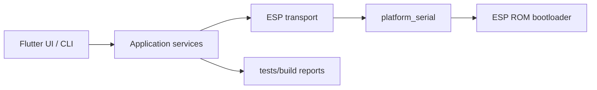

# ⚡ `flutter_esptool`

[](https://dart.dev)
[](https://flutter.dev)
[](LICENSE)
[](.github/workflows)
[](https://pub.dev/packages/flutter_esptool)

> 🔌 A professional Flutter package for ESP8266/ESP32 serial bootloader operations:
> chip detection, flash write/erase/read flows, MAC queries, and protocol utilities.

---

## ✨ Features

- 🧠 Chip detection via ROM register magic + MAC address read.
- 💾 Flash write/erase flows with optional compression and MD5 verification.
- 📦 Clean layered architecture (`application`, `domain`, `transport`, `infrastructure`, `models`).
- 🧪 Hardware-free tests with scripted/mocked transport.
- 🖥️ Professional multilingual demo app in `example/esptool_ui`.

---

## 🚀 Installation

```yaml
dependencies:
  flutter_esptool: ^0.1.3
```

---

## 🔧 Development Commands

```bash
flutter pub get
flutter analyze
flutter test
flutter test test\unit
flutter test test\integration
flutter test test\e2e
dart pub publish --dry-run
```

Cross-platform automation lives in [`scripts/`](scripts/README.md):

| Workflow | Windows | Linux | macOS | Report |
| --- | --- | --- | --- | --- |
| Setup dev machine | `scripts\\windows\\setup-dev.ps1` | `scripts/linux/setup-dev.sh` | `scripts/macos/setup-dev.zsh` | terminal summary |
| Run tests | `scripts\\windows\\run-tests.ps1` | `scripts/linux/run-tests.sh` | `scripts/macos/run-tests.zsh` | `reports/tests/<timestamp>/` |
| Build examples | `scripts\\windows\\build.ps1` | `scripts/linux/build.sh` | `scripts/macos/build.zsh` | `reports/builds/<timestamp>/` |

Single test file:

```bash
flutter test test/unit/transport/slip_codec_test.dart
```

Single test by name:

```bash
flutter test test/unit/transport/slip_codec_test.dart --plain-name "round-trips a payload through encode and decode"
```

---

## 📚 Documentation

- [`doc/ARCHITECTURE.md`](doc/ARCHITECTURE.md) — system architecture, service boundaries, and protocol data flow
- [`doc/WORKFLOWS.md`](doc/WORKFLOWS.md) — setup/test/build workflows with Mermaid diagrams
- [`doc/PROJECT_OPERATIONS_AND_QUALITY_GUIDE.md`](doc/PROJECT_OPERATIONS_AND_QUALITY_GUIDE.md) — professional operations, security, and full-spectrum testing guide
- [`scripts/README.md`](scripts/README.md) — cross-platform automation scripts
- [`doc/PUBLISHING.md`](doc/PUBLISHING.md) — pub.dev trusted-publishing release process
- [`doc/GITFLOW.md`](doc/GITFLOW.md) — branching and version strategy
- [`doc/DEMO_APP.md`](doc/DEMO_APP.md) — demo features and execution
- [`.github/copilot-instructions.md`](.github/copilot-instructions.md) — Copilot project guidance

---

## 🧪 Demo Application

Run the professional demo:

```bash
cd example\esptool_ui
flutter pub get
flutter run
```

The demo includes:

- 🌗 light/dark professional themes
- 🌍 multi-language UI (`en`, `fr`, `es`, `pt`, `de`, `it`, `nl`, `ru`, `ar`, `he`, `zh`, `ja`, `ko`)
- ✨ splash screen
- ⚙️ live serial-port workflow for connect, chip detection, MAC, flash info, erase, write, and MD5

## 🗺️ High-level workflow



---

## 📄 License

This project is licensed under the [MIT License](LICENSE).

## 🔐 CI, security, and merge gates

- PR open/update events trigger analyzer + unit/integration/e2e test jobs.
- Owner-authored PRs targeting `main` are auto-approved and auto-merged only after successful PR validation.
- Release publication uses GitHub OIDC trusted publishing (no long-lived `PUB_DEV_PUBLISH_TOKEN` secret).
