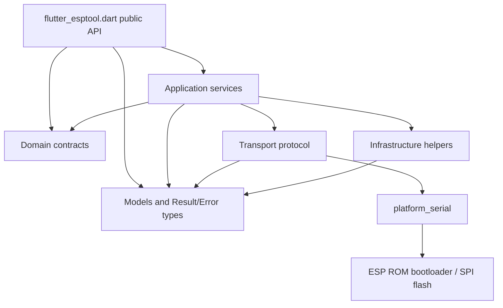
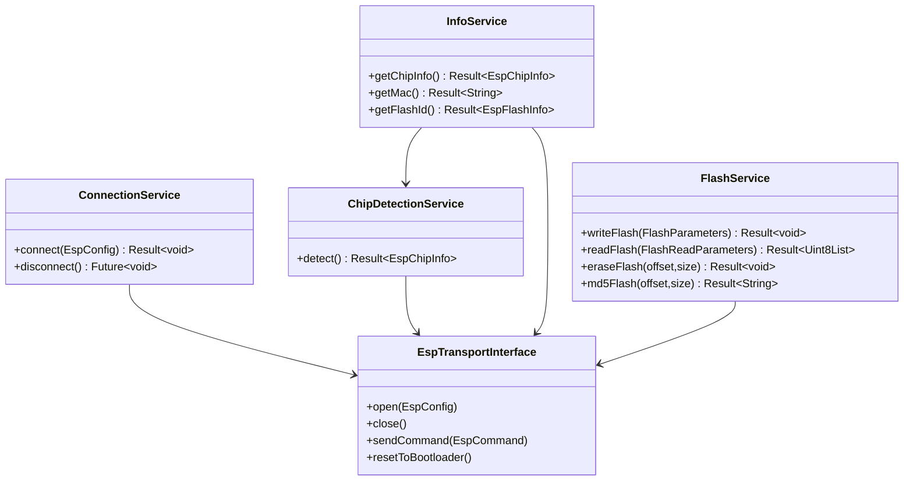
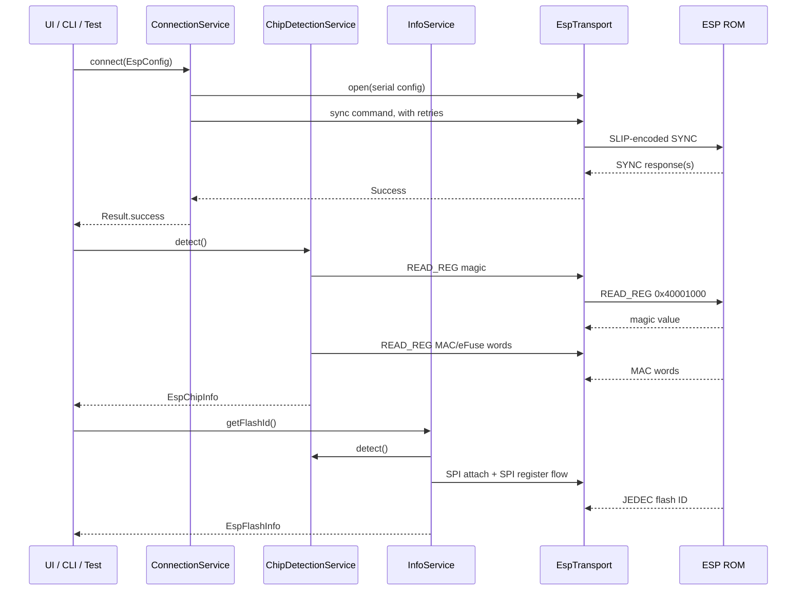
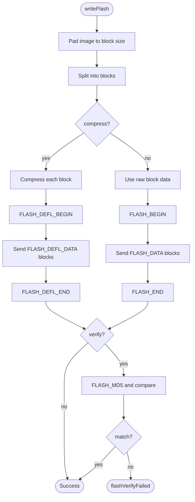
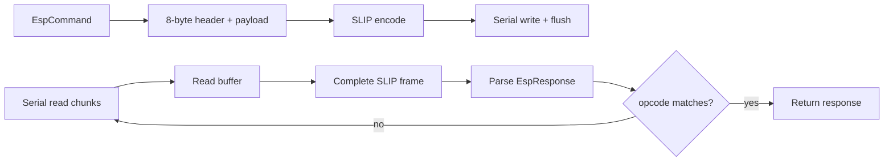
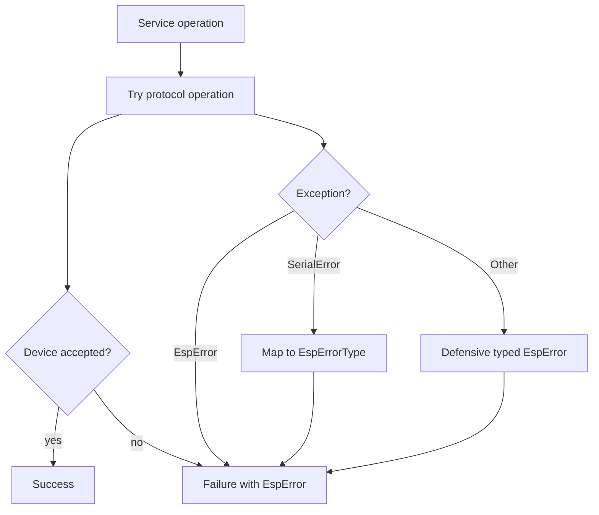
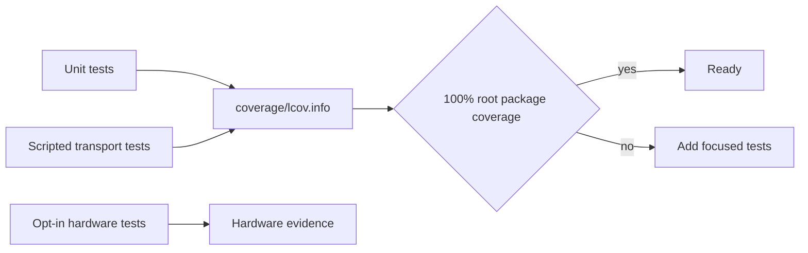

# Architecture

`flutter_esptool` is a layered Flutter/Dart package for ESP8266/ESP32 ROM bootloader workflows. The core package is UI-agnostic and talks to serial hardware through an injectable transport interface, making hardware-free tests possible.

## Package Layers

| Layer | Path | Responsibility |
| --- | --- | --- |
| Application | `lib/src/application/` | Orchestrates connection, chip detection, flash operations, and info reads. |
| Domain | `lib/src/domain/` | Service interfaces and domain contracts. |
| Transport | `lib/src/transport/` | ESP packet encoding, SLIP framing, response parsing, serial error mapping. |
| Infrastructure | `lib/src/infrastructure/` | Flash image parsing/building, partition parsing, compression helpers. |
| Models | `lib/src/models/` | Commands, config, progress, result/error, chip/flash metadata. |

## Service dependency graph

## End-to-End Connection and Info Flow

## Flash Write Flow

## Transport Boundary

`EspTransport` is the protocol boundary:

- builds command packets with little-endian fields;
- wraps packets using SLIP (`SlipCodec`);
- accumulates partial reads until a complete frame is available;
- ignores stale opcode responses until the expected command response arrives;
- parses frame payloads into typed `EspResponse`;
- maps `platform_serial` errors to package-level `EspError` values.

## Error and Result Strategy

- Service methods return `Result<T>` (`Success<T>` / `Failure<T>`).
- Operation failures are represented as typed `EspError` with `EspErrorType`.
- Transport-level exceptions are mapped to package-level errors.

## Testing Strategy

- Unit tests target codec, parser, model, and defensive branch behavior.
- Integration/e2e tests use scripted transport responses to validate protocol workflows without hardware.
- Hardware tests are opt-in and require an explicit port.
- Root package coverage is expected to stay at 100% for the current instrumented production lines.

