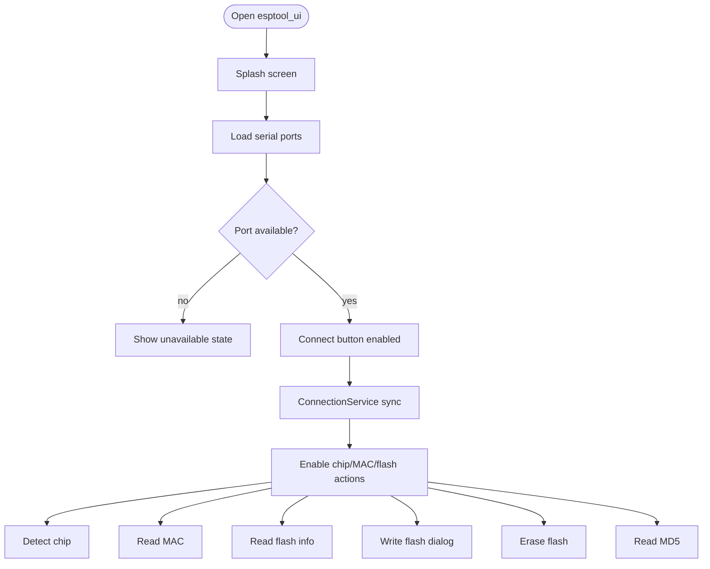
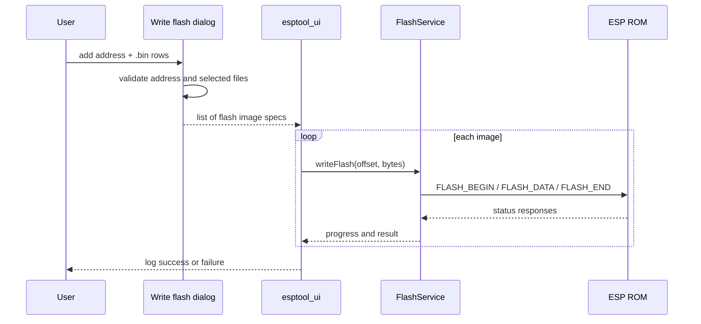

# Demo Applications

The repository contains two example applications:

| Example | Path | Purpose |
| --- | --- | --- |
| Professional UI | `example/esptool_ui` | Multilingual Flutter UI for serial ESP workflows. |
| CLI example app + Dart CLI | `example/esptool_cli` | Flutter shell plus `bin/esptool.dart` command-line clone workflows. |

## Professional UI

- Theme modes: light and dark
- Splash screen: built-in startup gate
- Languages: `en`, `fr`, `es`, `pt`, `de`, `it`, `nl`, `ru`, `ar`, `he`, `zh`, `ja`, `ko`
- Features: connect, chip detect, MAC read, flash info, flash write, erase, MD5

Run:

```bash
cd example/esptool_ui
flutter pub get
flutter run
```

## UI runtime workflow



## Write flash dialog workflow

The UI write flow accepts one or more address/file pairs. Each row has an address field and a `.bin` file picker button.



## Flash info display

`Flash info` reads the JEDEC ID and displays manufacturer, device ID, raw flash ID, and decoded capacity. Known COM22 hardware returns manufacturer `0xA1`, displayed as `Fudan Micro`.


## CLI example

Run the Dart CLI from `example/esptool_cli`:

```bash
cd example/esptool_cli
dart run bin/esptool.dart --help
```

Typical hardware commands:

```bash
dart run bin/esptool.dart chip_id --port COM22 --timeout 15
dart run bin/esptool.dart read_mac --port COM22 --timeout 15
dart run bin/esptool.dart flash_id --port COM22 --timeout 15
```

## Tests

Hardware integration test (explicit port required):

```bash
flutter test -d windows integration_test/esp32_hardware_test.dart \
  --dart-define=RUN_ESP_HARDWARE_TESTS=true \
  --dart-define=ESP_PORT=COM22
```

The demo uses the package's real `EspTransport` with `platform_serial`. If no serial plugin or ports are available, the UI stays usable and surfaces that state clearly.
