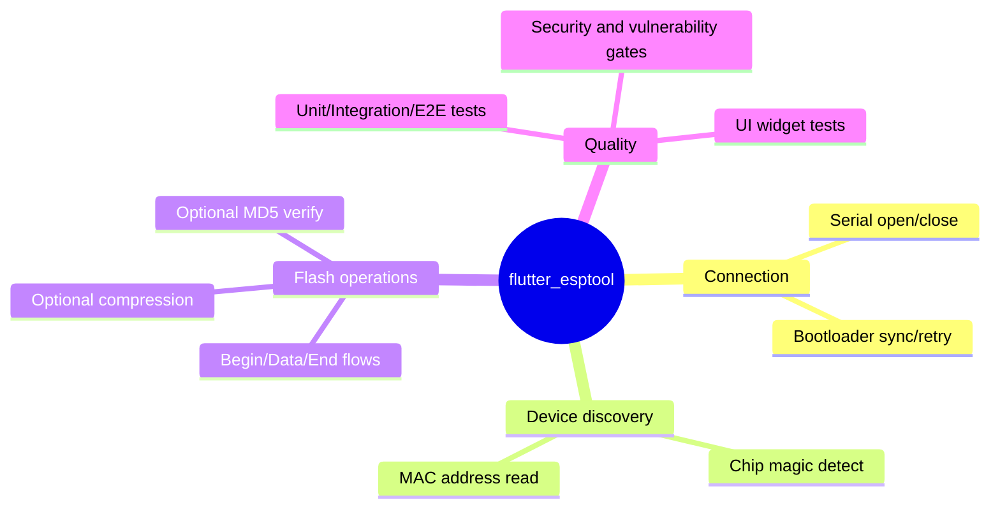
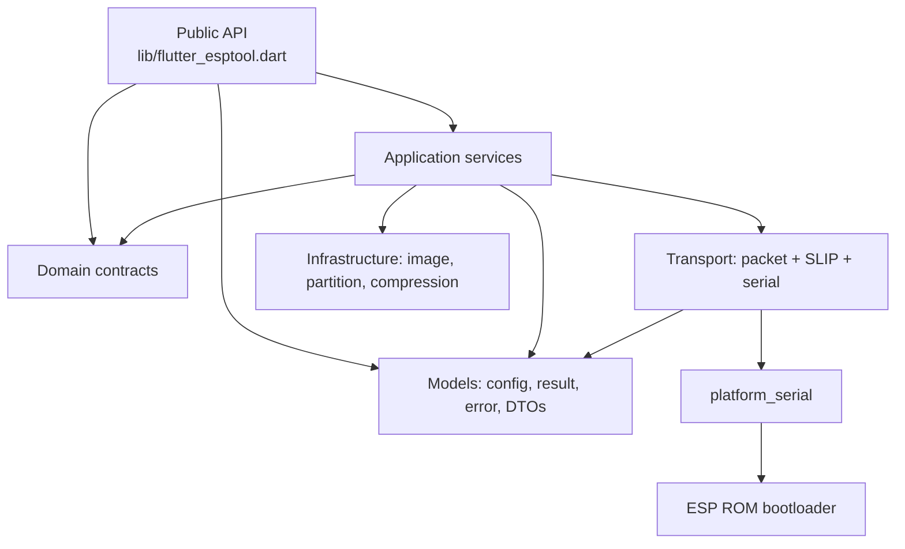
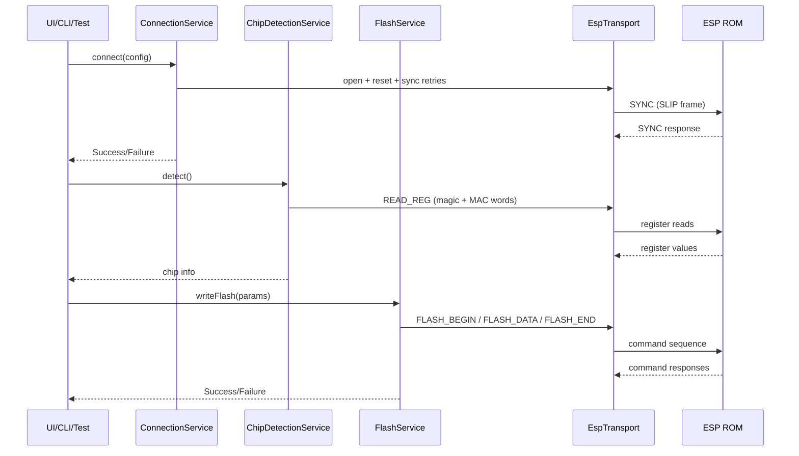
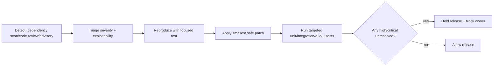
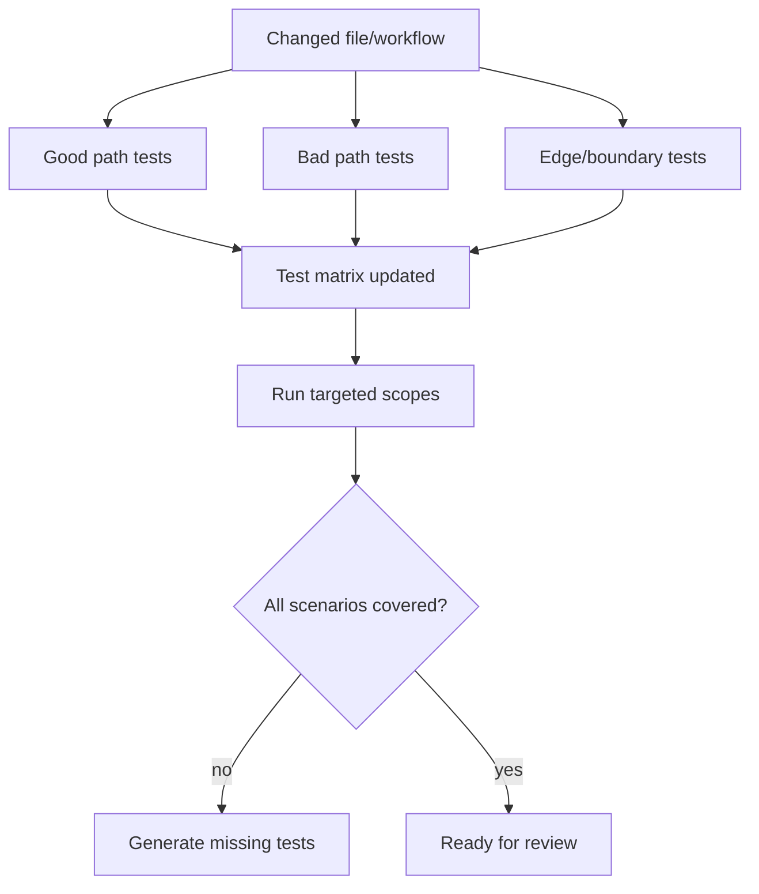
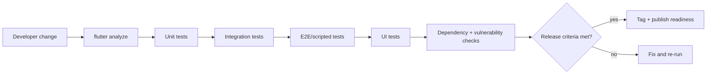

# Project Operations and Quality Guide

This guide provides a complete operational view of `flutter_esptool`, with architecture, delivery workflows, security practices, and full-spectrum testing guidance for package and UI layers.

## 1. Project profile

`flutter_esptool` is a layered Flutter/Dart package for ESP8266/ESP32 serial bootloader workflows. It is designed around:

- strict protocol correctness;
- typed failure handling with `Result<T>`;
- deterministic hardware-free testing;
- operational quality gates for CI and releases.

### 1.1 Capability map



## 2. Architecture and runtime flow

### 2.1 Layered architecture



### 2.2 End-to-end operation workflow



## 3. Security and vulnerability management

Security work in this project is operational, test-driven, and release-gated.

### 3.1 Vulnerability lifecycle



### 3.2 Severity policy

| Severity | Release policy | Required action |
| --- | --- | --- |
| Critical / High | Block release | Immediate fix and regression tests |
| Medium | Must be planned before next release | Patch + test coverage + issue tracking |
| Low | Track and monitor | Document risk and due date |

### 3.3 Secure coding guardrails

1. Preserve typed failures (`EspError`, `EspErrorType`) and avoid silent fallbacks.
2. Validate malformed or boundary payloads in transport/parser changes.
3. Keep protocol serialization little-endian and test byte-level correctness.
4. Keep automation deterministic and free of hardware dependency by default.

## 4. Full-spectrum test strategy

### 4.1 Test taxonomy

| Test type | Target | Primary intent |
| --- | --- | --- |
| Unit | codec/parser/model/helpers | branch, boundary, and transformation correctness |
| Integration | services + transport abstraction | orchestration and command-level behavior |
| E2E/scripted | full operation flows | multi-step protocol correctness without hardware |
| UI/widget | `example/esptool_ui` | state transitions, user feedback, and error UX |

### 4.2 Coverage model by scenario class



### 4.3 UI test guidance

For `example/esptool_ui`:

1. Verify loading, success, and failure states for each user operation.
2. Assert visible feedback content (messages, button state, progress indicators).
3. Include edge behavior (empty input, retry transitions, cancellation).
4. Use deterministic fake services/transports to avoid flaky tests.

## 5. CI/CD operational workflow



## 6. Operational runbook

### 6.1 Standard local workflow

```bash
flutter pub get
flutter analyze
flutter test
```

### 6.2 Focused execution during feature work

```bash
flutter test test\unit\transport
flutter test test\unit\infrastructure
flutter test test\integration\transport_mock_test.dart
flutter test test\e2e\flash_flow_e2e_test.dart
```

### 6.3 UI-focused validation

```bash
cd example\esptool_ui
flutter test
```

## 7. Quality gates and release readiness

Release readiness requires:

1. Analyzer and required tests passing for changed scopes.
2. Security triage completed with no unresolved high/critical vulnerabilities.
3. Regression coverage for impacted good/bad/edge scenarios.
4. Changelog/version alignment for release candidates.

### 7.1 PR automation gate

1. `PR Validation` runs `analyze`, `unit`, `integration`, and `e2e` jobs on PR open/update.
2. Only successful workflow runs are eligible for owner PR auto-approval and auto-merge to `main`.
3. Publication remains downstream of merge on `main`, preserving a single gated release path.

## 8. Recommended automation roles

The project now includes dedicated Copilot assets for this model:

- `vulnerability-guardrails` skill for security triage and remediation gating.
- `full-spectrum-test-generation` skill for comprehensive test generation.
- `full-spectrum-test-generator` sub-agent for unit/integration/e2e/UI automation.

These assets are designed to keep quality high while accelerating secure delivery.
