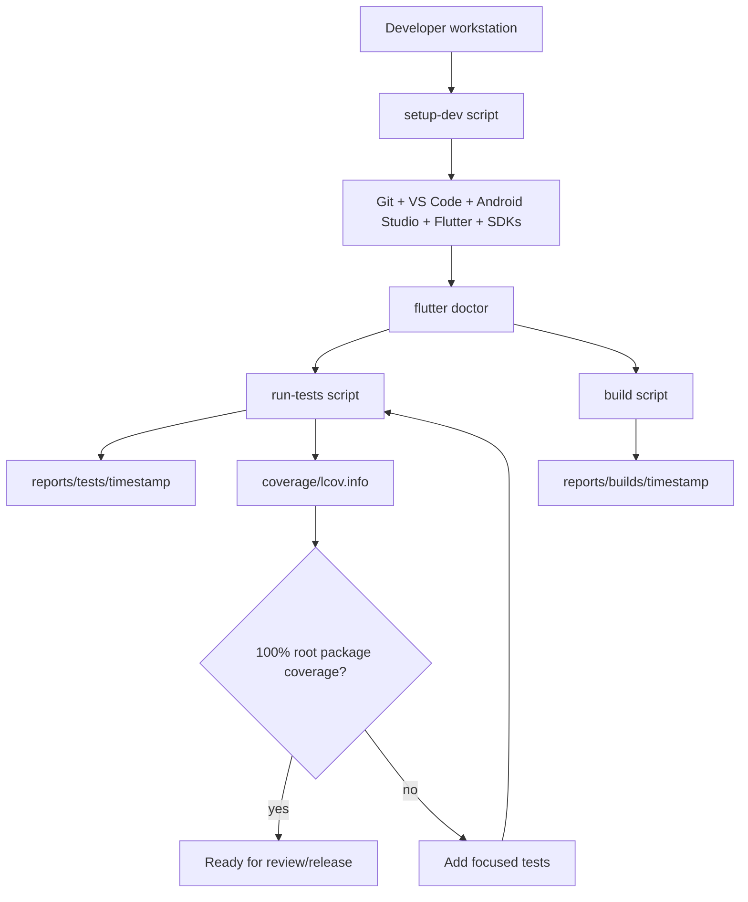
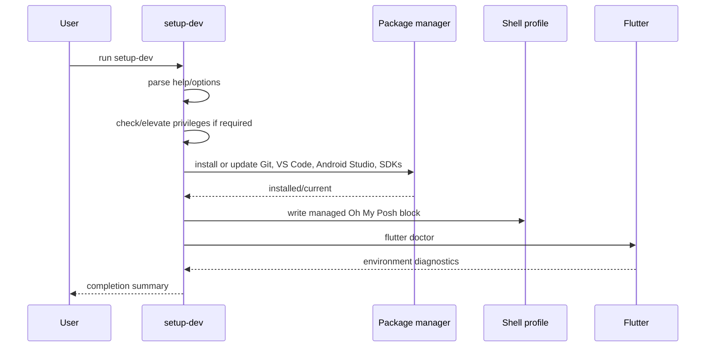
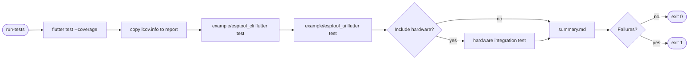
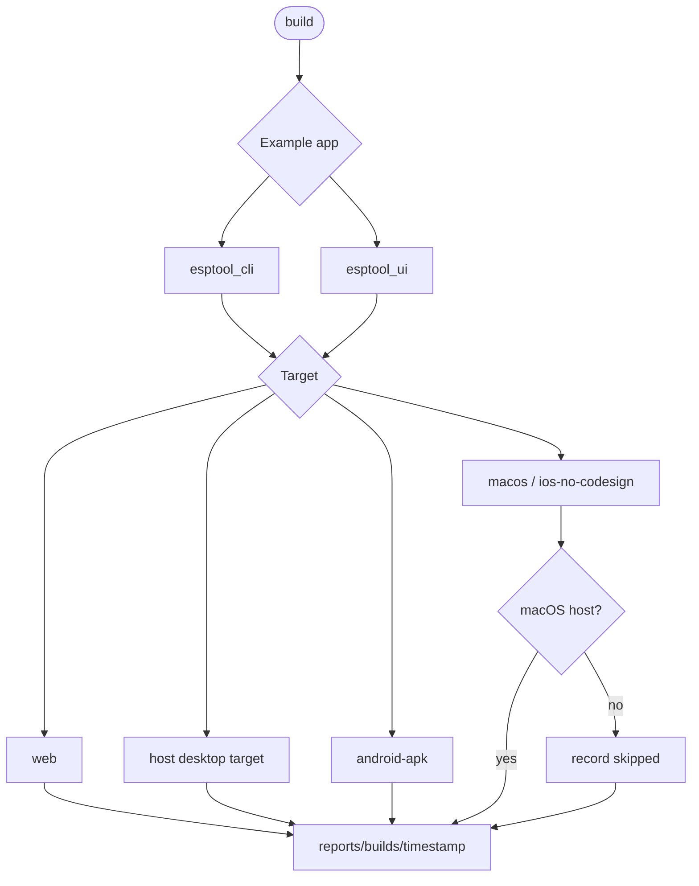
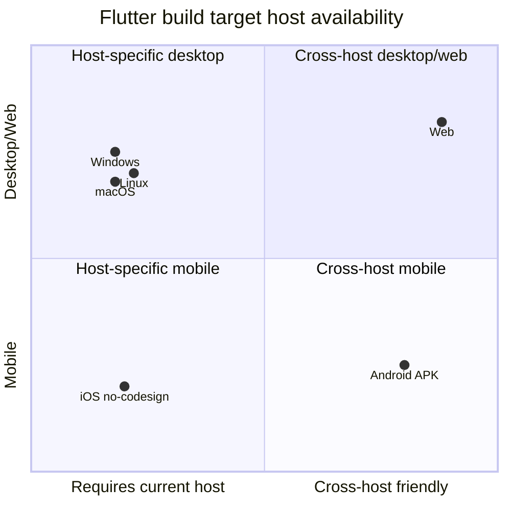

# Workflows and Automation

This document describes the development workflows provided by `flutter_esptool`.

## Repository workflow map

## Setup workflow

All platform setup scripts share the same intent and behavior:

- install or update the project development toolchain;
- configure shell startup for Oh My Posh with the `M365Princess` theme;
- remain idempotent so they can be re-run safely;
- elevate privileges only when package installation requires it.

## Test workflow

`run-tests` creates a timestamped report folder and runs the same logical test plan on each host:

1. root package tests, with coverage by default;
2. CLI example tests;
3. UI example tests;
4. optional hardware integration tests when explicitly requested.

## Build workflow

`build` attempts every Flutter target that can be built on the current host and records unsupported targets as skipped.

## Host capability matrix

