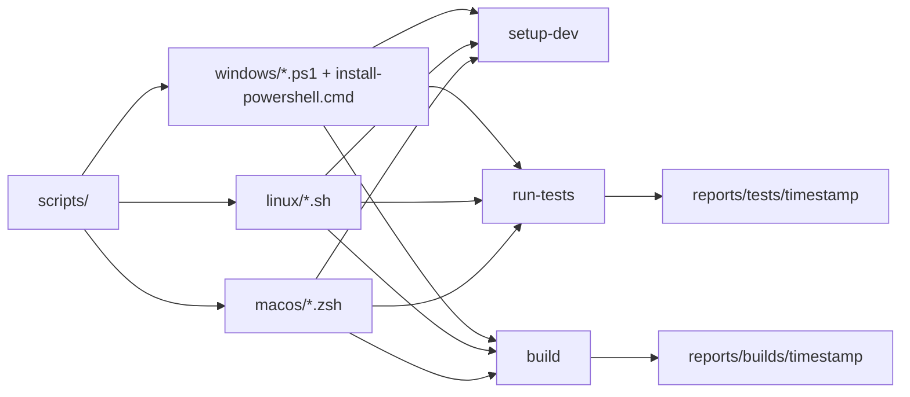
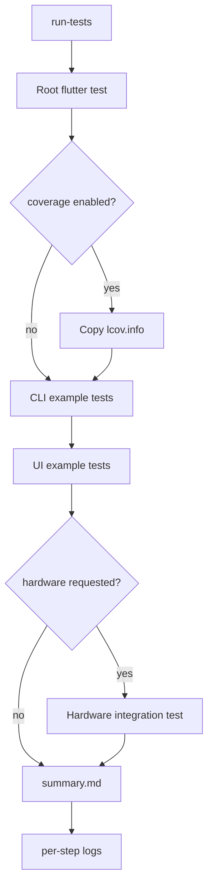
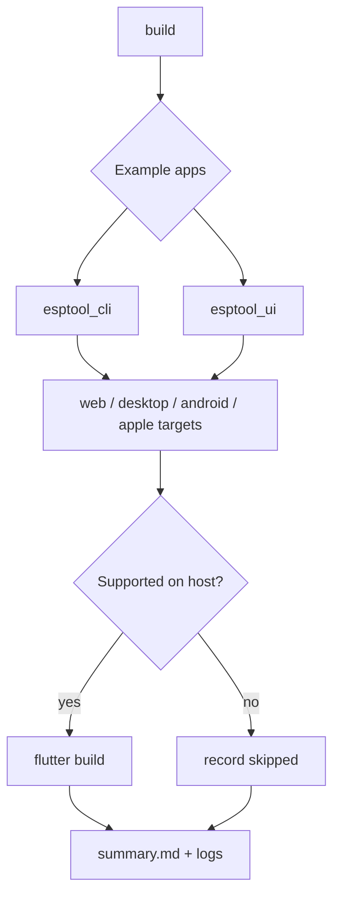

# Development setup scripts

This folder contains synchronized, idempotent setup scripts for the example-development environment.

## Layout

| Platform | Script | Shell | Purpose |
| --- | --- | --- | --- |
| Windows | `windows/setup-dev.ps1` | PowerShell | Install/update Git, VS Code, Android Studio, Flutter, Java/Android SDK tools, Oh My Posh and configure PowerShell profiles. |
| Windows | `windows/install-powershell.cmd` | Batch | Install or update the latest stable PowerShell with `winget`. Windows-only helper. |
| Windows | `windows/run-tests.ps1` | PowerShell | Run root/example tests and write a report under `reports/tests/`. |
| Windows | `windows/build.ps1` | PowerShell | Build example apps for host-supported Flutter targets and write a report under `reports/builds/`. |
| Linux | `linux/setup-dev.sh` | Bash | Install/update Git, VS Code, Android Studio, Flutter, Java/Android SDK tools, Oh My Posh and configure shell profiles across common distros. |
| Linux | `linux/run-tests.sh` | Bash | Run root/example tests and write a report under `reports/tests/`. |
| Linux | `linux/build.sh` | Bash | Build example apps for host-supported Flutter targets and write a report under `reports/builds/`. |
| macOS | `macos/setup-dev.zsh` | zsh | Install/update Git, VS Code, Android Studio, Flutter, Java/Android SDK tools, Oh My Posh and configure zsh. |
| macOS | `macos/run-tests.zsh` | zsh | Run root/example tests and write a report under `reports/tests/`. |
| macOS | `macos/build.zsh` | zsh | Build example apps for host-supported Flutter targets and write a report under `reports/builds/`. |

## Common behavior

All platform scripts are designed to have synchronized behavior:

- English synopsis/help.
- Colored output with emojis.
- Idempotent install/update or report generation operations.
- Elevation only when required by setup/package installation.
- `--help`, `--yes`, `--dry-run`, and `--no-elevate` style options for setup (`-Yes`, `-DryRun`, `-NoElevate` on PowerShell).
- Oh My Posh shell startup configured with the `M365Princess` theme using a managed marker block.
- Reports generated under `reports/`, which is intentionally ignored by git.

## Automation map



## Usage

```powershell
# Windows
.\scripts\windows\install-powershell.cmd
.\scripts\windows\setup-dev.ps1 -Yes
```

```bash
# Linux
chmod +x scripts/linux/setup-dev.sh
./scripts/linux/setup-dev.sh --yes
```

```zsh
# macOS
chmod +x scripts/macos/setup-dev.zsh
./scripts/macos/setup-dev.zsh --yes
```

## Test reports

```powershell
# Windows
.\scripts\windows\run-tests.ps1
```

```bash
# Linux
./scripts/linux/run-tests.sh
```

```zsh
# macOS
./scripts/macos/run-tests.zsh
```

## Build reports

```powershell
# Windows
.\scripts\windows\build.ps1 -Mode release
```

```bash
# Linux
./scripts/linux/build.sh --mode release
```

```zsh
# macOS
./scripts/macos/build.zsh --mode release
```

Reports are generated under `reports/`, which is intentionally ignored by git.

## Test workflow



## Build workflow



After setup, restart the shell and run:

```bash
flutter doctor
```
